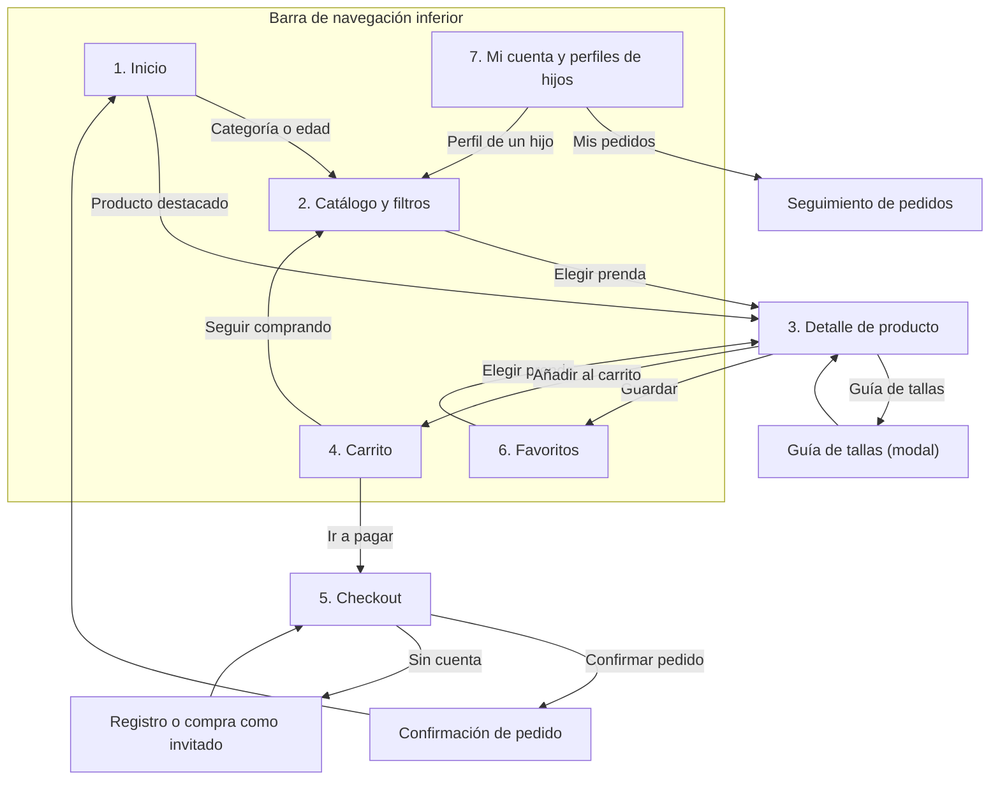

1. Justificación del Diseño:
• Importancia del Diseño Centrado en el Usuario: 

La importancia de este sale de el hecho de que un producto tiene buen valor si este es hergonómico. 

• Objetivos y Metas del Proyecto: Definición clara de lo que se espera lograr
con el diseño.

Se intenta hacer una interfaz clara y intuitiva para el usuario.

• Beneficios Esperados: Ventajas que el diseño aportará tanto al usuario final
como al negocio o aplicación.

El negocio puede aprender y corregir lo que el público quiere, mientras que el usurio recive una buena interfaz de alta calidad, que reduce la pérdida de tiempo.

2. Investigación y Análisis de Usuarios:
• Datos Demográficos y Segmentación: Información sobre el grupo objetivo
al que va dirigido el diseño.

El público objetivo o Target audience, es de adultos que compran ropa para niños, como madres y padre jóvenes, abuelos o familiares cercanos, o compradores de regalos.

• Necesidades y Comportamientos: Identificación de lo que los usuarios
esperan y cómo interactúan con aplicaciones similares.

Los usuarios esperan encontrar la talla adecuada de ropa, poder usar filtros para encontrar rápido la ropa por talla, género, color...
O tener un gestor de ayuda al cliente fácil y  accesible. 


TRES OBJETIVOS MEDIBLES:

-Atraer a gran número de compradores en el menor tiempo posible

-Que el asistente al cliente pueda responder al momento de necesitarlo, sin esperas.

-Poder introducir los datos de envío y bancarios con eficiencia y seguridad.

Ana Mena, 45 años, Su hijo de tres años se ha roto los pantalones y necesita unos nuevos, quiere comprar unos nuevos, necesita que lleguen pronto para un evento familiar que tiene.

Adolfo Gómez, 61 años, va a ser abuelo y va a regalarle ropa al niño para cuando este nazca, pero los padres no quieren que se sepa el género del bebé hasta el parto.


| App     | Qué hacen bien        | Qué hacen mal       |
|---------|-----------------------|---------------------|
| Mayoral | Escáner de códigos    | Bloqueos frecuentes |
| Zara    | Devolución con QR     | Falsa disponibilidad|
| Vinted  | Talla en edad y cm    | Estado según vendedor|

Conclusión: Priorizar talla por edad y altura, un carrito rápido y persistente, y accesibilidad desde el primer día.

• Insights y Hallazgos Clave: Puntos importantes descubiertos durante la fase
de investigación que influirán en el diseño.

-Como el usuario va a ser adulto normalmente, hacer la página a medida para esta edad, a pesar de que el producto esté destinado a otro tipo de audiencia.

-La talla de la ropa es algo por lo que se generan muchos errores y devoluciones, por lo que habría que incluir un gestor de tallas por altura, edad y peso.

-Este tipo de aplicaciones se suelen usar más en móbiles, por lo que habría que priorizar el diseño móbil.

-La Confianza al comprar un producto es indispensable, por lo que habría que ofrecer imágenes de calidad, vistas de detalle, medidas y, cuando sea posible, fotos en niños reales

3.1 Diseño de interfaz

3.3

primary / onPrimary	
#00629E / #FFFFFF	6,48:1
#9ACBFF / #003355	7,70:1

primaryContainer / onPrimaryContainer	
#CFE5FF / #001D34	13,31:1	
#004A79 / #CFE5FF	7,23:1

secondary / onSecondary	
#526070 / #FFFFFF	6,43:1	
#BAC8DA / #243240	7,70:1

tertiary / onTertiary	
#695779 / #FFFFFF	6,48:1	
#D4BEE6 / #392A49	7,69:1

surface / onSurface	
#FCFCFF / #1A1C1E	16,69:1	
#1A1C1E / #E2E2E5	13,22:1

error / onError	
#BA1A1A / #FFFFFF	6,46:1	
#FFB4AB / #690005	7,72:1

3.4
#### Rejilla y medidas

Todas las pantallas usan frames Android Compact de 360×800 dp con la siguiente rejilla, aplicada en Figma como *layout grid*:

| Parámetro | Valor |
|---|---|
| Columnas | 4 (tipo Stretch) |
| Márgenes laterales | 16 dp |
| Separación entre columnas (gutter) | 16 dp |
| Ancho de cada columna | 70 dp |
| Unidad base | 8 dp |
| Área táctil mínima | 48×48 dp |

Reparto del ancho de 360 dp (margen, columna, gutter, columna…):

```text
|16|  70  |16|  70  |16|  70  |16|  70  |16|
 ↑                                          ↑
margen                                    margen
```

16 + 70 + 16 + 70 + 16 + 70 + 16 + 70 + 16 = 360 dp.

**Criterios de diseño:**

- **Múltiplos de 8 dp:** márgenes, separación entre columnas, espaciados y tamaño de los componentes (8, 16, 24, 32, 40, 48, 56, 64). El ancho de las columnas (70 dp) es el resultado de dividir el espacio sobrante y por eso no es múltiplo de 8.
- **Áreas táctiles:** cualquier elemento interactivo (botones, chips, iconos, selector de talla) mide al menos 48×48 dp. Si el elemento se ve más pequeño, el área de toque se amplía hasta esa medida.
- **Catálogo:** cada tarjeta de producto ocupa 2 columnas (156 dp), por lo que caben 2 por fila.


